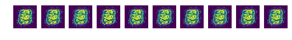
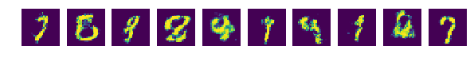
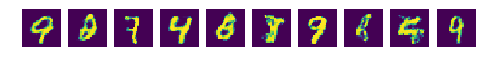

# CDAL_weekly_seminar
Introduction to Generative Adversarial Networks.
A Tensorflow implementation of [Generative Adversarial Nets](https://arxiv.org/abs/1406.2661)

# Prerequisites
- Python 2.7
- [Tensorflow1.1.0](https://www.tensorflow.org)
- Numpy

# Usage
To clone the repository to your local repo.

      $ git clone https://github.com/cjyu9211/cdal_gan

To train the model 
      
      $ python gan_tuto.py

# Result
- epoch 0

- epoch 99

- epoch 199

